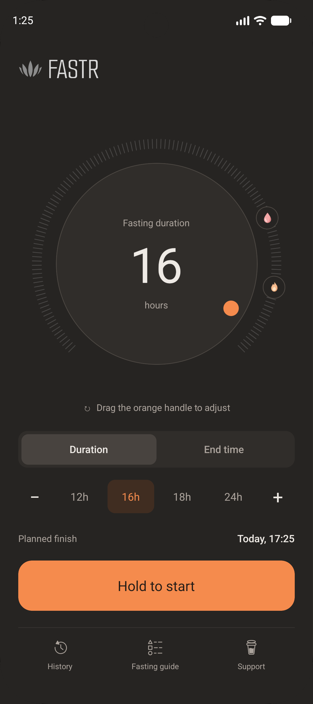
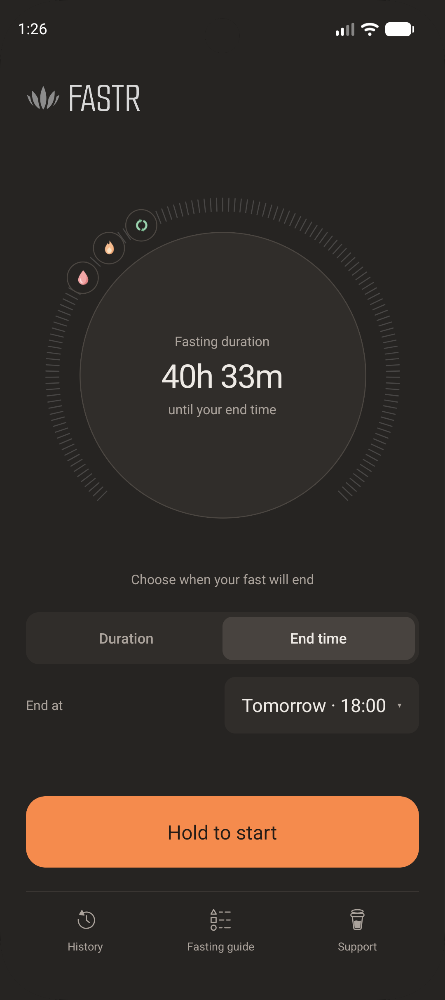
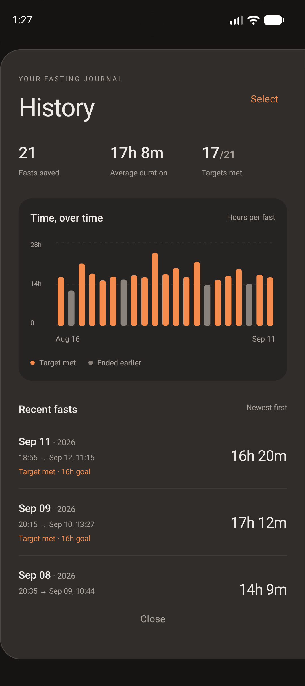
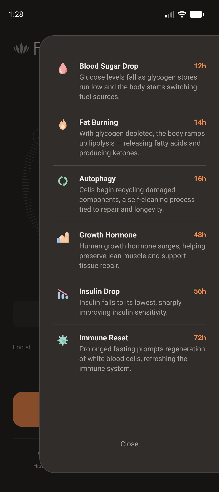

# FastR

A calm, minimal intermittent-fasting timer for Android, built with React Native.

FastR does one thing: it times your fasts. Pick how long you want to fast (or when you want to stop), hold the button to start, and watch the gauge fill as you pass the milestones along the way. No accounts, no ads, no tracking — everything stays on your device.

<p align="center">
  
  
  
  
</p>

## Features

- **Two ways to plan a fast**
  - **Duration** — drag the orange handle around the dial, use the `−` / `+` steppers, or tap a preset (12h, 16h, 18h, 24h).
  - **End time** — pick the day, hour and minute on iOS-style scroll wheels, up to a week ahead.
- **Hold to start / hold to end** — a deliberate press-and-hold, so a fast is never started or ended by accident.
- **Milestone gauge** — icons on the ring mark what happens as a fast progresses and light up as you reach them:

  | Milestone        | Hours in |
  | ---------------- | -------- |
  | Blood Sugar Drop | 12h      |
  | Fat Burning      | 14h      |
  | Autophagy        | 16h      |
  | Growth Hormone   | 48h      |
  | Insulin Drop     | 56h      |
  | Immune Reset     | 72h      |

- **Fasting guide** — a short explanation of every milestone.
- **History** — completed fasts with total count, average duration, targets met and a chart of recent fasts. Entries can be selected and deleted.
- **Survives restarts** — a running fast keeps going if the app is closed or the phone restarts.
- **Private by design** — data is stored only on the device (AsyncStorage); nothing leaves the phone.

## Tech stack

- [React Native](https://reactnative.dev) 0.86 (bare CLI, New Architecture, Hermes) with TypeScript
- [react-native-reanimated](https://docs.swmansion.com/react-native-reanimated/) 4 for animations
- [react-native-svg](https://github.com/software-mansion/react-native-svg) for the gauge and icons
- [@react-native-async-storage/async-storage](https://react-native-async-storage.github.io/async-storage/) for local persistence

## Getting started

### Prerequisites

- Node.js **22.11** or newer
- A working React Native Android environment (JDK, Android SDK, an emulator or a device with USB debugging) — see the [React Native environment setup guide](https://reactnative.dev/docs/set-up-your-environment)

### Run it

```bash
npm install
npm start          # starts Metro
npm run android    # in a second terminal: builds and installs the debug app
```

An `ios/` project is included, but the app is developed and released for Android; iOS builds are not actively maintained.

## Project structure

```
App.tsx                         Main screen: state, gauge, mode controls, panels
src/
  config.ts                     Milestones, defaults and tunable constants
  theme.ts                      Colours and font
  types.ts                      Shared types (FastEntry, ActiveFast, RingConfig…)
  components/
    FastingRing.tsx             SVG gauge with ticks and milestone chips
    HoursDial.tsx               Draggable dial for setting the duration
    GaugeLabels.tsx             Animated labels in the centre of the gauge
    PanelCarousel.tsx           Sliding Duration / End time control panels
    EndTimeSheet.tsx            Bottom sheet with day / hour / minute wheels
    WheelPicker.tsx             Reusable iOS-style scroll wheel
    BottomSheet.tsx             Slide-up sheet container
    SlidePanel.tsx              Slide-in side panel container
    HoldButton.tsx              Press-and-hold start / end button
    layout/                     Logo and footer navigation
    side-panels/                History, Fasting guide and Support panels
  utils/
    storage.ts                  AsyncStorage persistence
    format.ts, time.ts          Duration, date and clock helpers
assets/                         Icons, fonts, store images
```

## Support

FastR is free and built in spare time. If it helps you, you can [buy me a coffee](https://buymeacoffee.com/rootlevelit).
